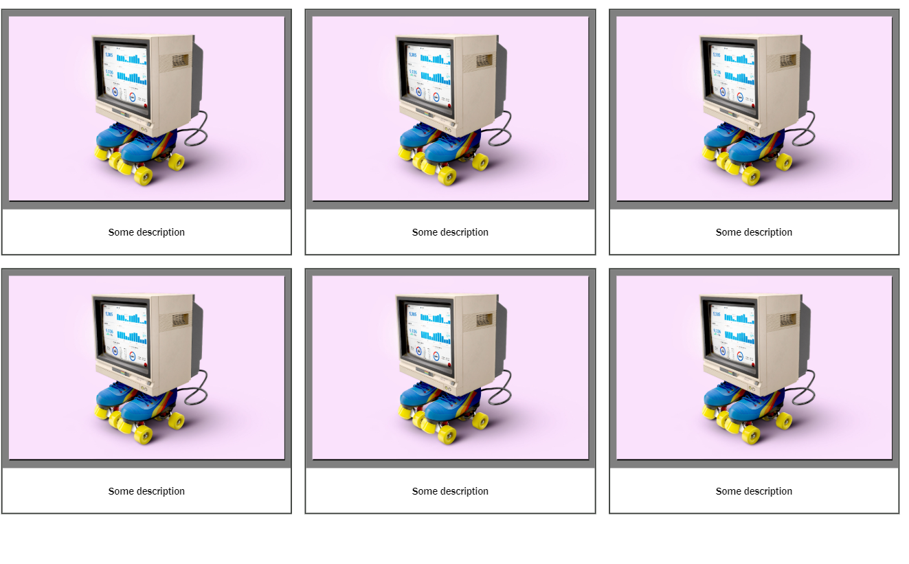

# Cards and responsive layout with grid

## Tasks: 
1. Create a grid container for the whole page (you can add a header and a footer to the page if you like). Create space between the grid rows and columns usign the `gird-gap`

2. Create cards: add html-elements (use `div`s) for the individual cards (these should be grid elements) and insert an image and a text in each card. Position the content of each card using grid!

3. Add styling around the photo, e.g.  a `background-color` or `border-style`.

4. Give the photo a shadow (`box-shadow`).

5. Add styling around the text, e.g. `padding` and a `background-color`, and add alignment of the text.

6. Give the text a nice font.

## Bonus:

Make the page responsive! 

For this, you can do *one* of the following:

- Change the properties of the grid container so that the page is responsive.
- Add media queries for a layout for mobile (under 668px), e.g. with one or two columns.

# Mockup for inner grid:

